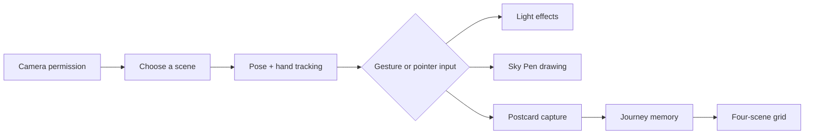

# Lumo｜旅光

<div align="center">

**Camera-based interactive AR travel experience**  
**基于摄像头的互动 AR 旅行体验**

[](https://react.dev/)
[](https://www.typescriptlang.org/)
[](https://ai.google.dev/edge/mediapipe/solutions/vision)
[](https://vite.dev/)
[](LICENSE)

*A small browser window becomes a living postcard.*

</div>

## Overview

Lumo is a browser-based interaction prototype that turns camera input, body movement, and hand gestures into a playful AR travel scene. It combines a live camera view with landmark-inspired environments, gesture-driven light effects, spatial drawing, and downloadable journey postcards.

The experience is designed to make an interaction feel visible, immediate, and memorable:

- choose a scene inspired by San Francisco landmarks or enter **Live Scene Studio**;
- use body poses and hand gestures to activate light, bubbles, confetti, waves, and orbiting effects;
- draw in the scene with **Sky Pen**;
- hold an **OK** gesture or press **Space** to capture a vertical postcard;
- collect four scenes into a downloadable 2 × 2 journey grid.

## What it demonstrates

| Area | Implementation |
| --- | --- |
| Camera interaction | Browser camera permission flow with a responsive mirrored preview |
| Gesture input | MediaPipe Pose Landmarker and Gesture Recognizer |
| Spatial feedback | Canvas-rendered effects, scene anchors, particles, trails, and transitions |
| Interaction design | Direct manipulation, gesture confirmation, cooldowns, and graceful fallbacks |
| Generative artifact | Client-side postcard and four-scene journey-grid creation |
| Visual system | Scene-specific palettes, typography, motion, and reusable UI states |

## Experience map



## Scenes

- **Golden Gate** — warm bridge light, bay haze, and sunset atmosphere
- **Cable Car** — electric blue tracks and moving street-light rhythm
- **Palace of Fine Arts** — violet, ice-blue, moonlit arches, and water ripples
- **Live Scene Studio** — place an anchor in any real space and choose a spatial effect

## Gesture vocabulary

- **Open Arms** — radial light beams
- **Hands Up** — rising glass bubbles
- **Victory** — balloons, confetti, and fireworks
- **Wave** — flowing light
- **Turn Around** — orbiting light trails
- **Jump** — ground-level light waves
- **OK / Space** — capture a postcard

The interface also supports pointer/touch manipulation and a dedicated drawing mode. Gesture recognition uses short confirmation windows and cooldowns so a single movement does not repeatedly trigger an effect.

## Run locally

Requirements: Node.js **22.13+**

```bash
npm install
npm run dev
```

Open the local address shown in the terminal, usually:

```
http://localhost:3000
```

Camera access works on `localhost) or an HTTPS deployment. The first launch may download the MediaPipe models and WASM runtime from their configured public endpoints, so an internet connection is needed unless the assets are hosted locally.

For a production build:

```bash
npm run build
npm run start
```

## Demo controls

| Key | Action |
| --- | --- |
| `F` | Toggle fullscreen |
| `D` | Toggle the calibration/debug overlay |
| `S` | Start the capture flow for a quick demonstration |
| `R` | Reset timers, particles, and the current experience |
| `← / →` | Move between scenes in Play mode |
| `Space` | Start postcard capture |

## Architecture

- `app/components/LumoExperience.tsx` — camera lifecycle and interaction orchestration
- `app/lib/poseDetector.ts` — pose tracking and body-action detection
- `app/lib/handDetector.ts` — pinch and OK-sign detection
- `app/lib/renderer.ts` — Canvas scenes, particles, effects, and Sky Pen
- `app/lib/postcard.ts` — vertical postcard generation
- `app/lib/journey.ts` — four-scene journey-grid generation
- `app/lib/stateMachine.ts` — interaction state and display copy
- `lumo-study/conditions/` — reusable interaction-mode definitions
- `lumo-study/shared/types.ts` — shared event and session types

## Notes on camera data

Lumo is built as a browser-side interactive experience. Review the deployment configuration and your local browser permissions before using it with any identifiable person or collecting any session data. Do not publish generated images containing other people without their permission.

## Project status

Working prototype. The visual experience, gesture vocabulary, fallback controls, and postcard pipeline are ready for local demonstration and further iteration.

## License

Released under the MIT License. See [LICENSE](LICENSE).
